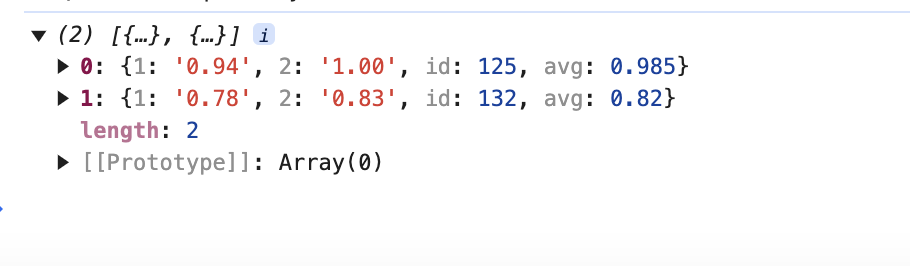

# SBA 308:JavaScript Fundamentals

## Objectives

- Employ basic JavaScript syntax accurately.
- Implement control flow structures such as conditionals and loops effectively.
- Use arrays and objects to organize and manage data.
- Develop functions to create reusable code.
- Utilize loops and iteration to navigate through data collections.
- Implement error handling to manage potential code failures gracefully.

## What the project does

The project consist of a script getLearnerData that gathers data, processes it, and then outputs a consistent result as specified.It accepts input as courseInfo, AssignmentGroup and LearnerSubmission.The output of the script is Learners profile in an assignment within a course.

- Result consist an array of all learner as objects inside an array:
  - Each learner object consist of
    - Learner Id
    - Learners weighted average
    - Percentage learner scored on each assignment

## Why the project is useful

- The getLearnerData project helps in keeping track of the performance of Learners by calculating the weighted average and individual performance in each assignment. It aslo
  considers the due date and submission date while calculating the result.

## How users can get started with the project

- User can get started by calling getLearnerData function and providing inputs as fallows in
  the same order.
- User should provide parameters as first should be Course Info, then AssignmentGroup and lastly LearnerSubmission.
- Then user should execute the function.
- This function returns the result as specified in preceeding section.

## Output

